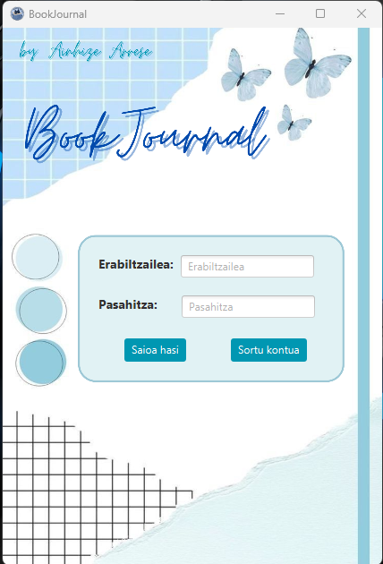
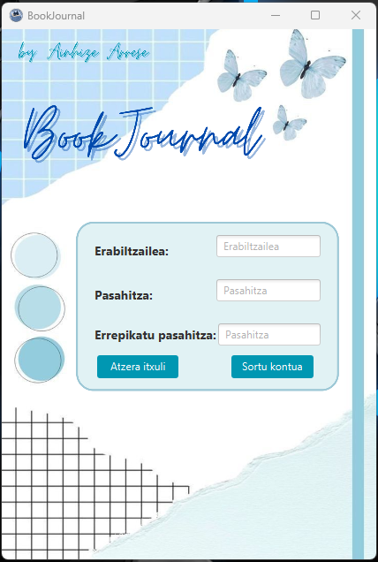
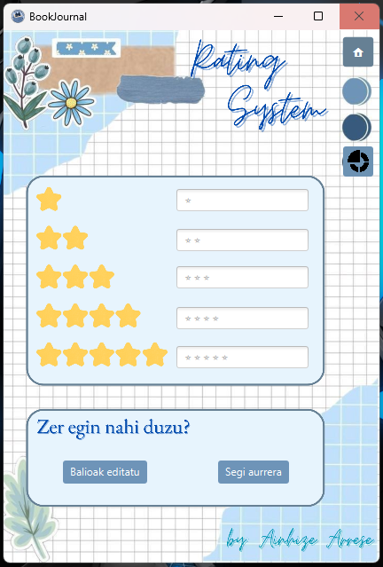
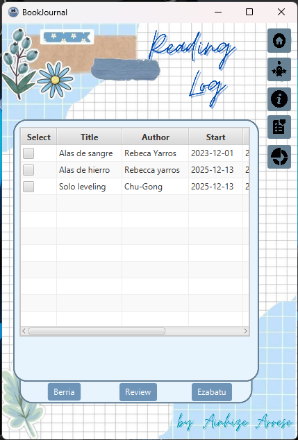
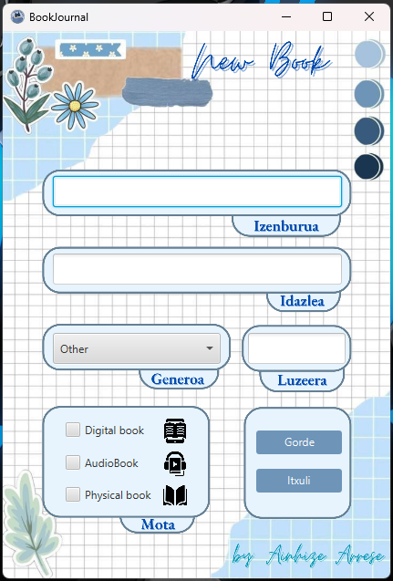
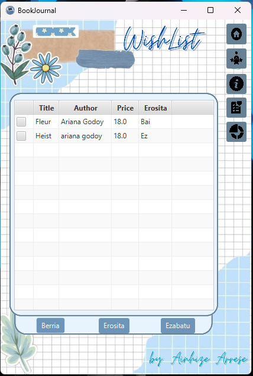
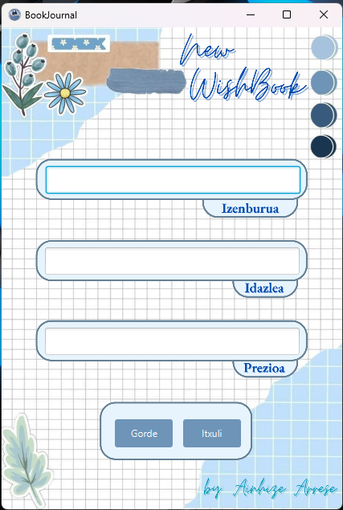
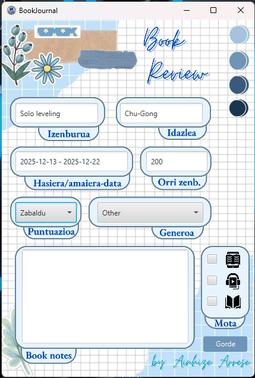
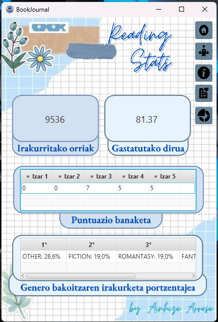
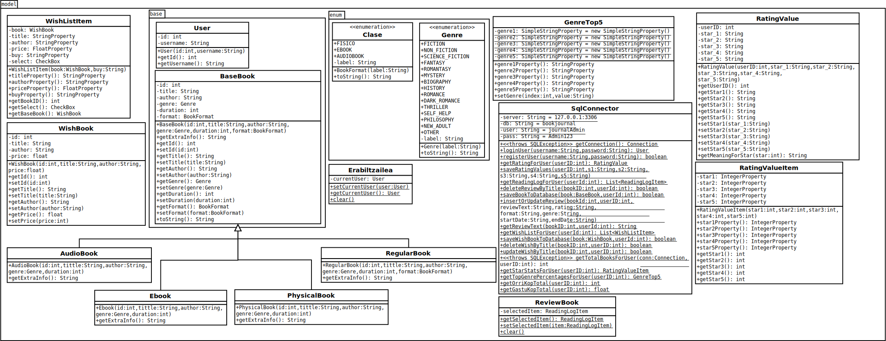

# 📚 BookJournal - Aplikazioa // Ebal3-BakarkakoLana
### 👩‍💻 Egilea

- [Ainhize Arrese](https://github.com/arreseAinhize)

##
## 🔎 AURKIBIDEA

- [1.- SARRERA](#1--sarrera)
  - [1.1.- Erabilitako Teknologia](#11--erabilitako-teknologia)
- [2.- INTERFAZE GRAFIKOAREN FLUXUA](#2--interfaze-grafikoaren-fluxua)
  - [2.1.- Hasiera orria](#21--hasiera-orria)
  - [2.2.- Rating System orria](#22--rating-system-orria)
  - [2.3.- Reading Log orria](#23--reading-log-orria)
  - [2.4.- Wishlist orria](#24--wishlist-orria)
  - [2.5.- Book Review orria](#25--Book-Review-orria)
  - [2.6.- Stats orria](#26--stats-orria)
- [3.- KLASE DIAGRAMA](#3--klase-diagrama)
- [4.- GEHIGARRIAK](#4--gehigarriak)
  - [4.1.- Azalpen laburra](#41--azalpen-laburra)
  - [4.2.- SQL Fitxategiak](#42--sql-fitxategiak)
- [5.- OHARRAK](#5--oharrak)
  - [5.1.- Lanaren ahulguneak](#51--lanaren-ahulguneak)
  - [5.2.- Etorkizunerako hobekuntzak](#52--etorkizunerako-hobekuntzak)

##
## **1.- SARRERA**:

BookJournal aplikazioa liburuak irakurtzen dituzten erabiltzaileentzat sortutako eguneroko digitala da. Helburua da erabiltzaile bakoitzak bere irakurketa ohiturak kontrolatzea eta hobeto ulertzea. Aplikazioak erabiltzailearen datuak gordetzen ditu, irakurritako liburuen inguruko informazioa jasotzen du eta estatistikak bistaratzen ditu.

Aplikazio honen bidez, erabiltzaileek beren irakurketa esperientzia hobeto antolatu dezakete, liburuei puntuazioa eman, desio-zerrendak sortu eta euren irakurketa ohituren gaineko ikuspegi bisual bat izan.

### <ins>1.1.- ERABILITAKO TEKNOLOGIA</ins>:
- Java (OOP printzipioak jarraituz)
- JavaFX (interfaze grafikoa)
- SceneBuilder (.fxml fitxategiak sortzeko eta kontrolatzeko)
- CSS (interfazearen itxura moldatzeko)
- XAMPP (datu-basearen kudeaketa)
- JDBC (Java eta datu-basearen arteko komunikazioa)

##
## **2.- INTERFAZE GRAFIKOAREN FLUXUA**:
### <ins>2.1- Hasiera orria</ins>

Log In:
Atal honetan, aplikazioaren sarrera-pantaila aurkezten da. Erabiltzaileek beren "Erabiltzailea" eta "Pasahitza" datuak sartu behar dituzte aplikazioan sartzeko. Eremu horiek pantailaren goialdean kokatuta daude, eta haien azpian "Saioa hasi" botoia agertzen da, sartutako datuak egiaztatzeko. Datuak zuzenak badira, erabiltzailea hurrengo atalera eramango da. Bestela, "Erabiltzaile-izena edo pasahitza okerrak dira." errore-mezua bistaratuko da, erabiltzaileari kredentzialak gaizki sartu dituela adieraziz.

Hau gertatuko da ***handleLogin*** funtzioak sartutako datuekin datu-basean bilaketa egin ondoren ***SqlConnector.loginUser(username, password)*** metodoak ***null*** balioa itzultzen badu; horrek esan nahi du ez dela aurkitu erabiltzaile hori pasahitz horrekin.

Pantailaren behealdean, "Gogoratu" aukera dago, erabiltzailearen saio-datuak gorde eta hurrengoan automatikoki sartzeko aukera eskaintzen duena. Horrez gain, "Sortu kontua" botoia ere ikus daiteke, eta horrek erabiltzaile berriak erregistratzeko aukera ematen du. Botoi horrek ***handleSignup*** funtzioa exekutatuko du eta erabiltzailea erregistro-pantailara eramango du.

Aplikazioaren leihoa ixteko aukera ere eskaintzen da pantailaren goiko eskuineko aldean, erabiltzaileak nahi duenean irten ahal izateko.

**ERABILTZAILE POSIBLEAK:**
 - ***User:*** *drackon* / ***Pass:*** *Admin123*  
 - ***User:*** *uxutxu* / ***Pass:*** *Ridoc123*  

### <ins>2.2- Rating System orria</ins>
Atal honek liburuen balorazioa kudeatzeko aukera ematen dio erabiltzaileari. Pantailaren goialdean "Rating System" izenburua agertzen da eskuz idatzitako estiloarekin, dekorazio koloretsuz lagunduta (loreak, pegatinak eta kolore urdinak).

Erdigunean, bost balorazio-maila ikus daitezke, izar kopuruaren arabera banatuta (1etik 5 izarrera). Maila bakoitzaren ondoan testu-kutxa bat dago, non erabiltzaileak izar kopuru horri dagokion azalpena edo balorazio irizpidea idatzi dezake. Adibidez: ★, ★★, ★★★★★, etab.

Pantailaren beheko aldean, "Zer egin nahi duzu?" galdera agertzen da kutxa batean, eta bi botoi aurkezten dira erantzun gisa:

Balioak editatu: Izarrei dagokien testua aldatzeko.

Segi aurrera: Hurrengo atalean jarraitzeko.

Eskuinaldean, nabigazio-botoiak ikus daitezke berriro, etxearen ikonoa barne, hasierara itzultzeko.

### <ins>2.3- Reading Log orria</ins>
Atal honetan, erabiltzaileek irakurketaren jarraipena egiteko aukera dute. Pantailaren goialdean "Reading Log" izenburua ageri da modu deigarrian, dekorazio elementu batzuekin apaindua (loreak, itsasgarriak eta kolore pastelak).

Tarte nagusian, taula bat aurkezten da, eta bertan irakurtzen ari diren liburuen informazioa ageri da: Select, Title, Author eta Start izeneko zutabeekin. Zutabe horietan, erabiltzaileak liburuaren izenburua, egilea eta hasiera-data ikus ditzake, baita hautapen-kutxa bat ere, elementuak aukeratzeko. Adibidez, Rebeca Yarros eta Chu-Gong autoreen lanak ageri dira zerrendan.

Pantailaren eskuineko aldean, zenbait botoi ikusten dira ikonoekin: ezarpenak, laguntza, eta bestelako funtzioetarako botoiak. Behealdean, hiru botoi daude: Berria, Review, eta Ezabatu, hurrenez hurren liburu berriak gehitzeko, iritziak idazteko eta aukeratutako elementuak ezabatzeko.

Aplikazioa estilo bisual atsegin eta ordenatuarekin aurkezten da, erabiltzaileari bere irakurketa-prozesua modu errazean antolatzeko aukera eskainiz.

### <ins>2.4- Wishlist orria</ins>
Atal honek erabiltzaileari bere desioen zerrenda kudeatzeko aukera eskaintzen dio. Pantailaren goiko eskuinaldean "WishList" izenburua agertzen da letra etzan eta dotore batekin idatzita. Diseinu orokorrak estilo argia eta urdin tonuak erabiltzen ditu, paper koadrikulatua gogorarazten duen atzeko plano batekin. Goiko ezkerreko izkinan eta beheko ezkerreko ertzean dekorazio elementu delikatuak daude, hala nola loreak eta hostoak, ukitu xarmangarri bat emanez.

Erdigunean, liburuen zerrenda bat taula formatuan ikus daiteke. Zutabeek "Title" (Izenburua), "Author" (Egilea), "Price" (Prezioa) eta "Erosita" (Erosita) etiketak dituzte. Une honetan, bi liburu agertzen dira zerrendan: "Fleur", Ariana Godoy egilearena eta 18.0 prezioan, "Bai" erosketa-egoerarekin; eta "Heist", baita Ariana Godoy egilearena eta 18.0 prezioan, "Ez" erosketa-egoerarekin. Errenkada bakoitzaren hasieran kontrol-lauki bat dago, ziurrenik liburuak hautatzeko erabilgarria.

Pantailaren beheko aldean hiru botoi daude: "Berna", "Erosita" eta "Ezabatu". Botoi hauek zerrendako liburuekin erlazionatutako akzioak burutzeko aukera ematen dutela dirudi.

### <ins>2.5- Book Review orria</ins>
Pantaila honek erabiltzaileari liburu baten berrikuspena sortzeko aukera ematen dio. Goiko eskuinaldean "Book Review" izenburua agertzen da letra eder eta kurbatuekin idatzita. Atzeko planoa aurreko pantailen estiloari jarraitzen dio, paper koadrikulatua gogorarazten duten urdin tonuekin eta goiko ezkerreko eta beheko ezkerreko izkinetan dekorazio elementu delikatuak dituena.

Erdigunean, berrikuspenari buruzko informazioa sartzeko hainbat eremu daude antolatuta. Goiko aldean, "Izenburua" eta "Idazlea" etiketak dituzten bi testu-koadro daude,kasu honetan "Solo leveling" eta "Chu-Gong" balioekin beteta hurrenez hurren.

Horren azpian, "Hasiera/amaiera-data" etiketa duen eremu bat dago, "2025-12-13 - 2025-12-22" tartea adierazten duena, eta eskuinaldean "Orri zenb." etiketa duen beste eremu bat, "200" zenbakia erakusten duena.

Jarraian, bi aukera-zerrenda daude: ezkerrekoak "Zabaldu" non erabiltzailearen puntuaziok agertzen diren, eta eskuinekoak "Other" aukera hautatuta du eta "Generoa" etiketa dauka.

Pantailaren behealdean, "Book notes" etiketa duen testu-koadro handi bat dago, berrikuspenaren oharrak idazteko pentsatua. Eskuineko aldean, "Mota" etiketa duen atal bat dago, hainbat kontrol-laukirekin: liburu fisikoa, audioliburua eta liburu elektronikoa irudikatzen dituzten ikonoekin.

Pantailaren beheko eskuinaldean "Gorde" botoi bat dago, ziurrenik sartutako informazioa gordetzeko funtzioa duena.

### <ins>2.6- Stats orria</ins>
Atal honetan, erabiltzailearen irakurketaren inguruko estatistika orokorrak bistaratzen dira, modu bisual eta egituratuan. Pantaila hau aplikazioaren barruko nabigazio-sistemaren bidez eskuratzen da, eta helburua da erabiltzaileari bere irakurketa-ohituren ikuspegi orokorra eskaintzea.

**Erabiltzaileari eskaintzen zaizkion datuak:**
 - *Irakurritako orriak:* Goiko ezkerreko koadroan bistaratzen da. Erabiltzaileak guztira irakurri dituen orri kopurua erakusten da (adibidez: 9536).
 - *Gastatutako dirua:* Goiko eskuineko koadroan agertzen da. Irakurketa-jardueretan erabilitako diruaren guztizkoa eurotan adierazita dago (adibidez: 81.37).

**Puntuazioen banaketa**
Pantailaren erdiko aldean puntuazio-sistema bat agertzen da, liburuei emandako izar kopuruaren arabera. Taula honetan izar bakoitzaren azpian, zenbat libururi puntuazio hori eman zaien erakusten da:

 - -Izar 1etik Izar 5era arteko banaketa.
 - Adibidez, 3 izarreko puntuazioa jaso duten 7 liburu daude.

**Generoaren araberako irakurketaren portzentajea**
Beheko aldean irakurritako liburuen generoaren banaketa bistaratzen da portzentaje gisa. Taula honek genero bakoitzak irakurketa osoan duen pisua adierazten du:

 - Lehen bost genero nagusiak erakusten dira (adibidez: OTHER, FICTION, ROMANTASY,FANTASY, THRILLER).
 - Portzentaje horiek irakurketaren zati nagusiak zein generotara dagozkien azpimarratzen dute.

**Nabigazio eta botoiak**
Pantailaren eskuineko aldean hainbat botoi agertzen dira, erabiltzaileari aplikazioko beste atal batzuetara azkar joateko aukera ematen diotenak. Botoi bakoitzak ikono bereizgarria dauka, eta funtzio zehatz bati lotuta dago (adibidez: estatistikak ikusi, erabiltzailearen-irakurketak, hasiera-pantaila, etab.).

##
## **3.- KLASE DIAGRAMA**:

##
## **4.- GEHIGARRIAK**:

### <ins>4.1.- AZALPEN LABURRA</ins>:
#### **HELBURUA**
BookJournal datu-basea erabiltzaileek irakurritako liburuen jarraipena egiteko sortu da. Erabiltzaile bakoitzak bere liburuak, iritziak, puntuazio pertsonalizatuak eta "wishlist" edo nahi dituen liburuak kudeatu ditzake.

#### **Datu-basearen Egitura**
1. Users: Erabiltzaileak gordetzen ditu.
 - *id*: Erabiltzailearen identifikatzaile bakarra (PK).
 - *username*: Erabiltzaile-izena (UNIQUE).
 - *password*: Pasahitza.

2. Book: Erabiltzaile bakoitzaren irakurritako liburuak.
 - *id*: Liburuaren identifikatzailea (PK).
 - *userID*: Liburua irakurri duen erabiltzailea (FK).
 - *title, author, genre*: Liburuari buruzko informazioa.
 - *duration*: Orri kopurua edo iraupena.
 - *format*: Fisikoa, eBook edo Audiobook (ENUM).

3. WishList: Erabiltzaileek nahi dituzten liburuen zerrenda.
 - *id*: Elementuaren identifikatzailea (PK).
 - *userID*: Norena den zerrenda hori (FK).
 - *title, author*: Liburuari buruzko informazioa.
 - *erosita*: Erosia dagoen ala ez (Bai/Ez).
 - *price*: Prezioa.

4. RatingValue: Erabiltzaile bakoitzaren puntuazio-sistema pertsonalizatua.
 - *userID*: Erabiltzailearen ID-a (PK + FK).
 - *star_1 … star_5*: Iritzi deskribapen pertsonalizatuak izar bakoitzeko.

5. Review: Erabiltzaileek emandako iritziak.
 - *id*: Iritziaren identifikatzailea (PK).
 - *bookID, userID*: Norena den eta zer libururi buruzkoa den (FK).
 - *reviewText*: Testu osoa.
 - *rating, format, genre*: Balorazioaren laburpena eta datu gehigarriak.
 - *startDate, endDate*: Irakurketaren hasiera eta amaiera datak.

#### **Erabiltzailea**
Erabiltzailea sortzen da aplikazioak datu-basean lan egin ahal izateko:

`CREATE USER IF NOT EXISTS 'journalAdmin'@'%' IDENTIFIED BY 'Admin123';`

`GRANT INSERT, SELECT, UPDATE, DELETE ON bookjournal.* TO 'journalAdmin'@'%';`

### <ins>4.2.- SQL FITXATEGIAK</ins>:

- [SQL fitxategia](./bookjournal/src/main/resources/paagbat/sql/bookjournal.sql)

##
## **5.- OHARRAK**:

### <ins>5.1.- Lanaren ahulguneak</ins>:
 - *Datuen sarrera-mekanismoaren fidagarritasuna:* Erabiltzaileak datuak eskuz sartu behar ditu hainbat kasutan (data tartea, orri kopurua, etab.), eta horrek erroreak sortzeko aukera areagotzen du. Ez dago formatuaren balidazio automatikorik kasu guztietan.
 - *Interfazearen egokitzapena tamaina ezberdinetara:* Leihoaren tamaina aldaketek zenbait elementu gaizki kokatzea edo informazioa estaltzea eragin dezakete. Ez dago diseinu erabat errespetibo edo moldakor bat.
   
### <ins>5.2.- Etorkizunerako hobekuntzak</ins>:
 - Aplikazioaren nabigazioa hobetzeko, menu printzipal bat. Non, aplikazioaren atal dezberdinetara joateko aukera emango den.
 - Liburuen portaden irudiak gehitzeko aukera: Erabiltzaileei aukera eman liburuaren azalaren irudia gehitzeko, erabiltzaile-esperientzia bisualago eta pertsonalizatuagoa izateko.
 - Estatistika aurreratuagoak: Denboran zeharreko grafikoak gehitzea (hilabeteka irakurritako orriak, puntuazioen bilakaera...), erabiltzailearen irakurketa-ohiturak hobeto ulertzeko.
 - Gogokoen zerrenda: Erabiltzaileak gehien gustatu zaizkion liburuak gogokoen gisa markatu ahal izatea eta haien zerrenda bereizi bat edukitzea.
