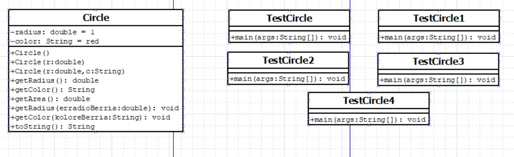

## Getting Started

    Welcome to the VS Code Java world. Here is a guideline to help you get started to write Java code in Visual Studio Code.

## Folder Structure

    The workspace contains two folders by default, where:

    - `src`: the folder to maintain sources
    - `lib`: the folder to maintain dependencies

    Meanwhile, the compiled output files will be generated in the `bin` folder by default.

    > If you want to customize the folder structure, open `.vscode/settings.json` and update the related settings there.

## Dependency Management

    The `JAVA PROJECTS` view allows you to manage your dependencies. More details can be found [here](https://github.com/microsoft/vscode-java-dependency#manage-dependencies).

## Zer aurkituko dugu bertan

    Java proiektu berri bat sortu "01-ZirkuluenProiektua" izenarekin, UD2 karpetaren barruan. Bi fitxategi bi izango ditu:
    - Circle.java
    - TestCircle.java

    https://chua.bitbucket.io/java/J3a_OOPBasics.html#zz-2.8 helbidean aurkituko dituzu fitxategi bi horiek.

    0.- Marraztu Dia programarekin proiektu honetan sortu dituzun klaseen diagrama. (.svg formatuan)

    1.- Aldatu TestCircle1.java laugarren zirkulu bat sortuz. Zirkulu handi eta urdina izango da.

    2.- Aldatu TestCircle2.java lau zirkuluen informazioa horrela inprimatu dadin:

    Zirkulua   Erradioa    Kolorea    Azalera
    ==========================================
        c1     2.00       blue    12.57
        c2     2.00        red    12.57
        c3     1.00        red     3.14
        c4     5.00       blue    78.54

    2.75.- Zer inprimatzen du hurrengo sententziak TestCircle.java programan? System.out.println("Azken zirkulua: " + c4);
        --> Azken zirkulua: Circle@4e50df2e (imprimatuko du.)

    3.- Irakurri apunteetako 2.15 atala eta aldatu Circle.java toString() metodoa gehituz
    => Circle[radius=?, color=?]

    3.25.- Eta orain zer inprimatzen du 2.75 puntuko sententziak?
        --> Circle[radius=3.0,color=blue]

    4.- Irakurri apunteetako 2.13 atala eta aldatu Circle.java setRadius() eta setColor() metodoak gehituz.

    5.- Aldatu TestCircle.java klasea: 10 aldiz  c1  handitu => inprimatu. Seigarrenean kolorea aldatu.

    Circle[Radius:2.0,Color:blue]
    Circle[Radius:3.0,Color:blue]
    Circle[Radius:4.0,Color:blue]
    Circle[Radius:5.0,Color:blue]
    Circle[Radius:6.0,Color:blue]
    Circle[Radius:7.0,Color:blue]
    Circle[Radius:8.0,Color:magenta]
    Circle[Radius:9.0,Color:magenta]
    Circle[Radius:10.0,Color:magenta]
    Circle[Radius:11.0,Color:magenta]