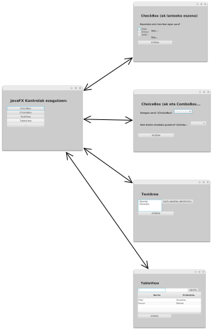

# JavaFX Kontrol Anitz
Proiektu honetan JavaFX eszenetan erabili daitezkeen kontrol desberdinen adibideak daude.
Datuak, zuzenean kodigoan daude txertatuta, datu-base edo fitxategi batetik irakurri beharrean.

*Hard coding (also hard-coding or hardcoding) is the software development practice of embedding data directly into the source code of a program or other executable object, as opposed to obtaining the data from external sources or generating it at runtime.* 

Baina proiektuaren egitura prest dago datu-base edo fitxategi atzipenerako.

## Itxura
